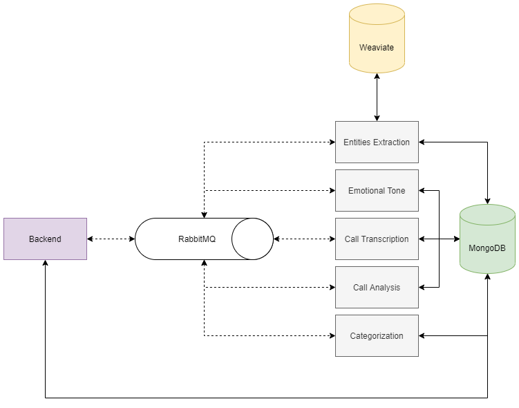

## Tecnhological Stack
Project is tightly related to AI/ML, thai is why i chose Python to implement the solution.

The main libraries used in the project include:
fastapi, pydantic, celery, sentence_transformers, keybert, pytorch, whisperx, pytest, pymongo, 

As the storage for analysis results I selected MongoDB, as a higly scalable and efficient document based database, and Weaviate as the storage for the vector embeddings (refer to section 'Calls Categorization').

As the communication transport between backend and workers I selected RabbitMQ, since it is de-facto standard approach for tasks distribution in python applications and it has great support in celery.


## Solution Architecture
As the main purpose of the solution is to analyze big amounts of phone calls data, this system was designed as highly scalable and distributed. Currenty the system consists of:
- backend that is responsible for extracting the results and presenting them to user via API
- workers that are responsible for audio and text analysis tasks

The following architecture allows to scale components individually according to hardware requirements, traffic load etc.



On the component level I used hexagonal architecture. It allows to build modular and highly testable systems that are able to be easily adjusted to new requirements. There are three layers:
- api: this layer is responsible for REST API, it's schema and input validation
- domain: this layer contains adapter for AI models and business logic regarding categories and call analysis
- infrastructure: this layer contains implementation for DB adapters, repositories and workflow setup for call analysis

## Text Analysis
Text processing pipeline is optimized to be highly distributed and parallel. At first, audio call transcription is obtained. Then three parallel jobs are triggered: emotional tone analysis, entities extraction and categorization. In celery worflow looks the following way:
```python
def analyze_call(call_id: str, audio_url: str):
    workflow = chain(
        set_status.si(call_id, CallAnalysisStatus.IN_PROGRESS),
        download_and_transcribe_audio.si(call_id, audio_url),
        chord(
            group(
                identify_call_entities.s(call_id),
                identify_emotional_tone.s(call_id),
                classify_category.s(call_id),
            ),
            set_status.si(call_id, CallAnalysisStatus.FINISHED),
        ),
    )

    workflow.apply_async(link_error=set_status.si(call_id, CallAnalysisStatus.FAILED))
```
Results of the call analysis are stored in MongoDB with the following data model:
```json
{
    "call_id": "string",
    "emotional_tone": "string",
    "transcription": "string",
    "extracted_entities": {
        "ENTITY_TYPE_1": "string",
        "ENTITY_TYPE_2": "string"
    }
}
```
### Phone Call Transcription

For phone call transcription, I chose to use WhisperX, an advanced automatic speech recognition model. Balancing between quality and resource requirements i chose **base.en** model as the default one. WhisperX offers great transcription accuracy, even in challenging conditions such as background noise or varying accents. Being an open-source model, WhisperX aligns with our goal of not sending data to external APIs, ensuring data privacy and security.

The model processes the audio file and generates a text transcript of the conversation, which serves as the foundation for further analysis steps.
### Emotional Tone Analysis
To analyze the emotional tone of the transcribed calls, I utilized the **j-hartmann/emotion-english-distilroberta-base** model. This model is capable of classifying text into seven emotional categories: anger, joy, disgust, sadness, fear, neutral, and surprise.
After obtaining the emotion scores from the model, they are combined to get the final emotional tone using the following rules:
```python
combined_scores = {
    CallEmotionalTone.ANGRY: emotion_scores["anger"],
    CallEmotionalTone.POSITIVE: emotion_scores["joy"],
    CallEmotionalTone.NEGATIVE: emotion_scores["disgust"] + emotion_scores["sadness"] + emotion_scores["fear"],
    CallEmotionalTone.NEUTRAL: emotion_scores["neutral"] + emotion_scores["surprise"]
}
```
### Call Entities Extraction
For call entities extraction, I utilized the Named Entity Recognition (NER) capabilities of the spaCy library, specifically employing the **en_core_web_sm** model. This model identifies various entity types such as person names, organizations, locations, dates, and more within the transcribed text. To determine the caller's identity, I implement a heuristic that assumes the first occurrence of a person's name in the transcript is likely the caller, based on the common practice of self-introduction at the call's start.

### Calls Categorization

Calls categorization could be interpreted as a classification task, however according to the system requirements categories and their key points can be updated or deleted at a run time, that is why retraining model would be inefficient. That is why the algorithm should easily adapt to new categories, and not introduce extra load for reevaluation of call in case some categories were changed.
The approach that I propose is based on the similarity search between key points in the category and key points mentioned in the call.  This approach consists of the following steps.

On the category add, update or delete:
- embed category name and key points using **all-mpnet-base-v2** model
- save embeddings into the vector database
```python
def add_category(self, category: Category):
    properties = self.__create_properties(category)
    vectors = self.__embed_text(properties)
    with self.collection.batch.dynamic() as batch:
        for p, vector in zip(properties, vectors):
            batch.add_object(
                properties=p,
                vector=vector
            )

def __create_properties(self, category):
    properties = []
    properties.extend([self.__create_key_point_document(category.id, category.title, point) for point in category.points])
    properties.append(self.__create_category_document(category.id, category.title))
    return properties
```
During the call analysis:
- extract keywords for the call trascription
- embed keywords using **all-mpnet-base-v2** model
- save keywords embeddings into the vector database
```python
def classify(self, call_id: str, transcription: str):
    keywords = self.keywords_extractor.extract(transcription)
    self.keywords_store.insert(call_id, keywords)
```

When results of analysis are requested:
- extract keyword vectors from vector database
- extract similar categories by cosine similarity > 0.5

```python
def get_result(self, call_id: str) -> List[str]:
    result = set()
    keyword_vectors = self.keywords_store.get(call_id)
    for category in self.category_store.get_similar(keyword_vectors):
        result.add(category)
    return result


def get_similar(self, vectors: List[np.array], threshold=0.5) -> list[str]:
    result = set()
    for vector in vectors:
        response = self.collection.query.near_vector(
            near_vector=vector,
            distance=threshold,
            return_metadata=MetadataQuery(distance=True)
        )
        for o in response.objects:
            result.add(o.properties["category"])
    return list(result)
```

## How To Start Application
To start an application please use the following command:
```
docker compose up --build
```

## Testing
To run unit tests in docker container please use the following command: 
```
docker exec devchallenge-xxi-backend bash -c "cd /app/tests && pytest -v"
```

## Corner Cases Covered
- **large files handling:** in case file content cannot fit into the model, it is splitted into chunks and then results are aggregated
- **calls categorization after category updates and deletes:** by utilizing shared latent vector space for key topics in categories and keywords in calls it is not needed to recalculate all categorization results for each of the calls

- **in case of error during the analysis user will be given a correspoding details**

- **system works correstly in case there is noise in the input audio**

- **system works correctly for different accents in english**

- **all components of the system don't send data to external APIs which is critical for such a solution**

- **system chooses the surname and name of the caller in case both are present**

- **each call can have multiple categories or no category at all**

- **concurrent analysis runs and asynchronous processing**: system can handle multiple analysis requests simultaneously balancing the load between workers

## Further Steps
- Deploy application in the cloud

- Utilize GPU for faster speech-to-text

- Speech diarization in processing pipeline

- LLM based embeddings for categories classification

- Open souce LLM (like llama) to conduct text analysis
